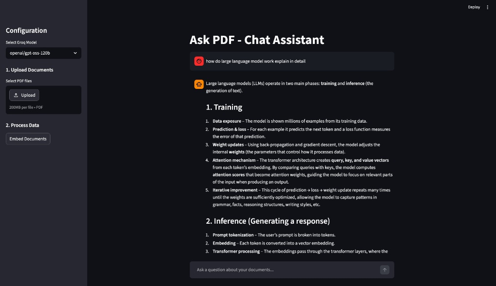

# 🚀 AskPDF: AI-Powered Document Assistant

AskPDF is a containerized, full-stack AI application that allows users to upload multiple PDF documents and engage in a real-time conversational Q&A experience.



Built using:
- Streamlit
- LangChain
- FAISS
- HuggingFace Embeddings
- Groq LLM APIs

The application uses Retrieval-Augmented Generation (RAG) to provide accurate responses strictly based on the uploaded documents.

---

# ✨ Features

- Persistent Chat UI with session-based conversation history
- Fast semantic search using HuggingFace embeddings + FAISS
- Blazing-fast inference using Groq Cloud (Llama-3 / Mixtral)
- Fully Dockerized deployment for portability
- Lightweight and optimized Docker image
- Security-focused setup with `.env`, `.gitignore`, and `.dockerignore`
- Multi-PDF support
- Retrieval-Augmented Generation (RAG) pipeline

---

# 🛠️ Tech Stack

| Component | Technology |
|---|---|
| Frontend | Streamlit |
| LLM Orchestration | LangChain |
| Embeddings | HuggingFace Sentence Transformers |
| Vector Database | FAISS |
| LLM Provider | Groq |
| Containerization | Docker |

---

# 🧠 How It Works

```text
PDF Documents
      ↓
PyPDF Loader
      ↓
Text Splitting
      ↓
HuggingFace Embeddings
      ↓
FAISS Vector Store
      ↓
Retriever
      ↓
Groq LLM
      ↓
Streamlit Chat Interface
```

---

# 📂 Project Structure

```text
.
├── main.py              # Streamlit application logic & RAG pipeline
├── Dockerfile           # Docker build instructions
├── requirements.txt     # Python dependencies
├── README.md            # Project documentation
├── .dockerignore        # Docker build optimization
├── .gitignore           # Git security filters
├── .env                 # Environment variables (local only)
└── Docs/                # Local PDF storage
```

---

# 🚀 Getting Started

## 1. Prerequisites

Install the following:

- Docker Desktop
- Groq API Key
- HuggingFace Token

### Useful Links

- Docker Desktop: https://www.docker.com/products/docker-desktop/
- Groq Console: https://console.groq.com/
- HuggingFace Tokens: https://huggingface.co/settings/tokens

---

# 🔐 Environment Setup

Create a `.env` file in the root directory:

```env
GROQ_API_KEY=your_groq_api_key_here
HF_TOKEN=your_huggingface_token_here
```

IMPORTANT:
- Never commit `.env` to GitHub
- Keep your API keys private

---

# 🐳 Docker Setup

## Step 1: Build Docker Image

Run the following command from the project root:

```bash
docker build -t askpdf-app .
```

---

## Step 2: Run Docker Container

```bash
docker run -d --name askpdf-container -p 8501:8501 --env-file .env askpdf-app
```

---

## Step 3: Open the Application

Visit:

```text
http://localhost:8501
```

---

# 🧾 Dockerfile Overview

The Docker container:

- Uses lightweight Python base image
- Installs required dependencies
- Copies application source code
- Exposes Streamlit port
- Runs the Streamlit application automatically

---

# 🛡️ Security & Privacy

## API Security

- `.env` is excluded using `.gitignore`
- API keys are never hardcoded

---

## Docker Privacy

The following are excluded using `.dockerignore`:

- `.env`
- `.venv`
- local PDFs
- FAISS indexes
- IDE files

This keeps the image:
- lightweight
- secure
- production-ready

---

# ⚡ Performance Optimizations

- FAISS enables ultra-fast semantic retrieval
- HuggingFace embeddings run locally
- Groq provides extremely low latency inference
- Docker image optimized using slim Python base image
- Dependency layers cached for faster rebuilds

---

# 📚 RAG Pipeline

The application follows a Retrieval-Augmented Generation workflow:

1. Load PDF documents
2. Split text into chunks
3. Generate embeddings
4. Store vectors in FAISS
5. Retrieve relevant chunks
6. Send context to LLM
7. Generate accurate answers

---

# 📄 License

This project is intended for educational and learning purposes.
